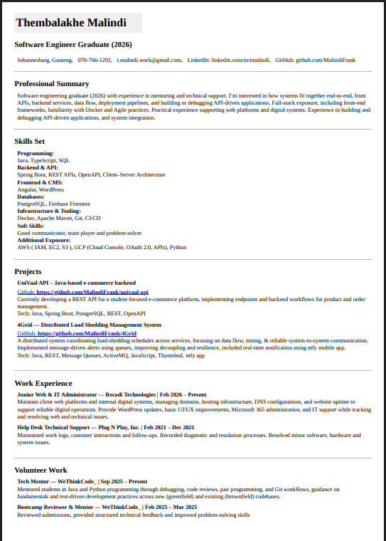

# ATS Resume

# 360 ATS Resume Builder 

## Why it works?
- No signs, no distractions, no nonsense.
- You make changes on the ATS template, no going back and fourth.
- Placeholders are there to guide you on how to structure things.
- Everything is editable, simply click on what you want to change or remove it.
- It works perfectly on your smartphone.

Click on the existing template and start editing.

A **fast** and **easy** solution for `creating` a professional `ATS Resume` in `under 5 minutes`. Without hassle edit your resume `on the go`, using just your `smartphone`. `No signups`  
[Try Me!](https://360resume.netlify.app/)

## Features

- **Instantly Save as PDF**:
- **Simply Click-on-text-to-Edit**:
- **Live Preview PDF**:

## Getting Started 

1. **Edit Text**: Click on any text to edit or clear it. Replace the existing placeholder text with your own information.
2. **Save as PDF**: Click the download button to `Save as Pdf`, a print dialog will show up where you can save your Resume. Additional you can adjust layout settings such as page margins, `set margins to 'none' or '0'`.
3. **Live Preview PDF**: The print dialog provides a preview of your resume in PDF format before saving.
4. **Add Content**: Click the "Add button" to add additional pre-formatted sections to your ATS Resume.  
[Take a Quick Look!](https://360resume.netlify.app/)

[**Check It Out!**](https://360resume.netlify.app/)
